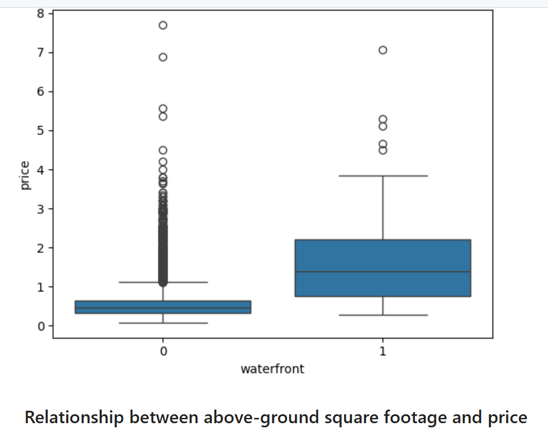
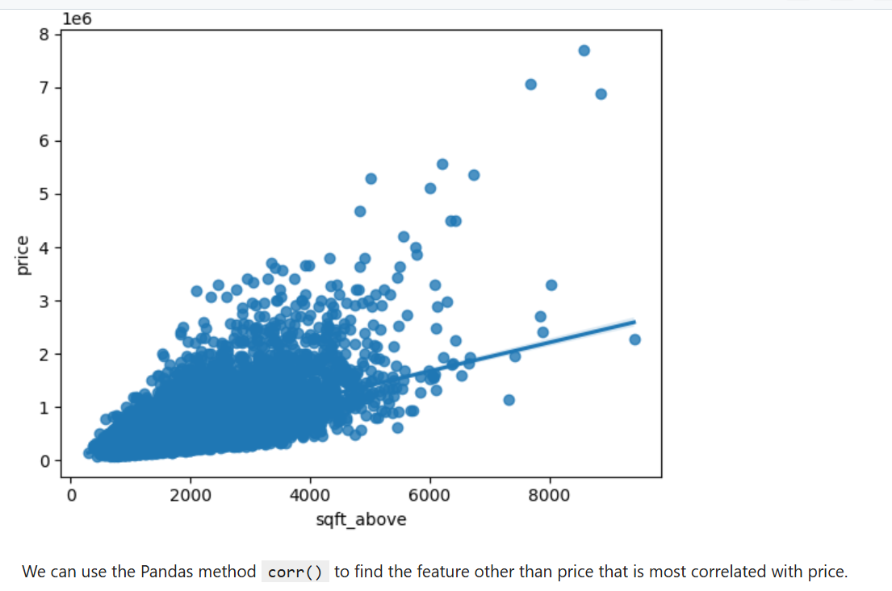

# King County House Sales Analysis

## Project Overview

This project analyzes house sales data from King County, Washington, including the Seattle area. The goal is to explore housing features, understand price patterns, and build regression models to estimate house prices.

The analysis includes data inspection, data cleaning, exploratory data analysis, visualization, and machine learning model development using Python.

## Dataset

The dataset contains house sale records for King County, Washington, for homes sold between May 2014 and May 2015.

Key features include:

- Sale price
- Number of bedrooms and bathrooms
- Square footage of living space and lot size
- Number of floors
- Waterfront status
- View rating
- House condition and grade
- Basement size
- Latitude and longitude
- Year built and renovation year

The target variable for prediction is:

- `price`

## Project Objectives

- Import and inspect the housing dataset
- Identify and handle missing values
- Remove unnecessary identifier columns
- Explore relationships between house features and sale price
- Visualize price patterns using charts
- Build regression models to predict house prices
- Evaluate model performance using R² score
- Compare simple linear regression, multiple linear regression, pipeline-based regression, Ridge regression, and polynomial Ridge regression

## Tools and Libraries Used

- Python
- Jupyter Notebook
- Pandas
- NumPy
- Matplotlib
- Seaborn
- Scikit-learn

## Analysis Workflow

### 1. Data Import and Inspection

The dataset was loaded into a Pandas DataFrame and inspected using common methods such as:

- `head()`
- `dtypes`
- `describe()`
- missing value checks

### 2. Data Cleaning

The data cleaning process included:

- Dropping unnecessary identifier columns
- Checking missing values
- Replacing missing values in `bedrooms` and `bathrooms` with their column means
- Reviewing summary statistics after cleaning

### 3. Exploratory Data Analysis

Several exploratory analysis steps were completed, including:

- Counting houses by number of floors
- Comparing waterfront and non-waterfront home prices
- Exploring the relationship between square footage and house price
- Checking correlation between numeric features and price

### 4. Data Visualization

The project includes visualizations such as:

- Count plots
- Box plots
- Regression plots
- Correlation-based analysis

These visualizations help show how different house features relate to sale price.

### 5. Model Development

Several regression models were created to predict house prices:

- Simple Linear Regression using `sqft_living`
- Multiple Linear Regression using selected housing features
- Pipeline-based Linear Regression
- Ridge Regression
- Polynomial Features with Ridge Regression

### 6. Model Evaluation

Model performance was evaluated using the R² score. The project compares how different feature sets and regression techniques affect prediction performance.

## Key Features Used for Prediction


The main predictive features used in the models include:

- `floors`
- `waterfront`
- `lat`
- `bedrooms`
- `sqft_basement`
- `view`
- `bathrooms`
- `sqft_living15`
- `sqft_above`
- `grade`
- `sqft_living`

## Skills Demonstrated

- Data cleaning and preparation
- Exploratory data analysis
- Data visualization
- Correlation analysis
- Regression modeling
- Machine learning pipeline creation
- Model evaluation using R² score
- Working with real-world housing data

## Project Structure

```text
king-county-house-sales-analysis/
│
├── README.md
├── king_county_house_sales_analysis.ipynb
└── housing.csv
```

## How to Run This Project

1. Clone or download this repository.
2. Open the notebook in Jupyter Notebook, JupyterLab, VS Code, or Google Colab.
3. Make sure the dataset file is available in the project folder.
4. Install the required libraries if needed:

   ```bash
   pip install pandas numpy matplotlib seaborn scikit-learn
   ```

5. Run the notebook cells from top to bottom.

## Results Summary

The analysis shows that house price is strongly related to features such as living area, grade, location, bathrooms, view, and waterfront status. Regression models were used to estimate house prices, and model performance improved when multiple relevant features were included.


## Possible Future Improvements

- Add more advanced regression models such as Random Forest or Gradient Boosting
- Tune model hyperparameters for better performance
- Add interactive visualizations
- Create a dashboard version of the project
- Deploy the model as a simple web app

## Author

**Saeeda Younus**

Data Analyst | Python | SQL | Excel | Power BI | Machine Learning


When uploading to GitHub, rename it to:

README.md
