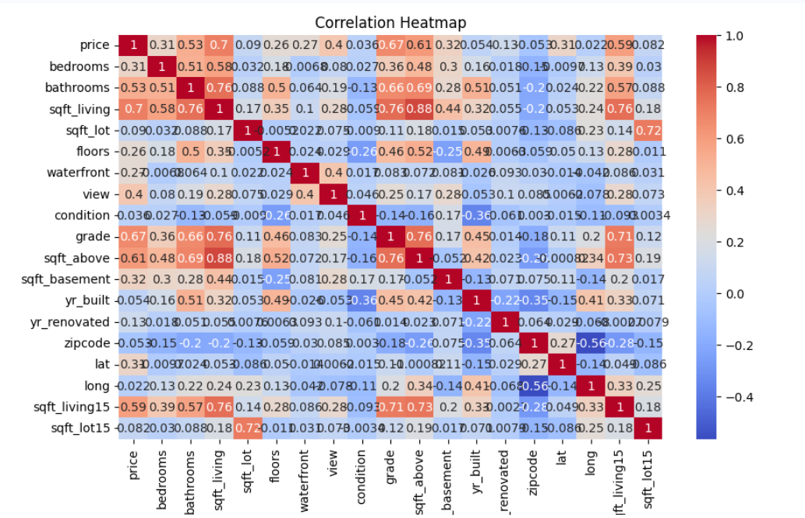

Done — I created the GitHub-ready README file for your King County House Sales Analysis project.

README_king_county_house_sales_analysis_v2.md
# King County House Sales Analysis

## Project Overview

This project analyzes house sales data from King County, Washington. The goal is to explore the main factors that influence house prices and build regression models that can estimate housing prices based on property features.

The project includes data exploration, data cleaning, visualization, feature analysis, and machine learning model development using Python.

## Dataset

The dataset contains residential house sale records from King County, Washington.

Common fields analyzed in this project include:

- House price
- Number of bedrooms
- Number of bathrooms
- Square footage of living space
- Square footage of lot
- Number of floors
- Waterfront status
- View rating
- House condition
- House grade
- Basement size
- Year built
- Year renovated
- Location-related features such as latitude and longitude

The main target variable is:

```text
price
```

## Project Objectives

- Load and inspect the housing dataset
- Understand the structure and quality of the data
- Clean missing or unnecessary values
- Explore relationships between house features and sale price
- Create visualizations to identify trends and patterns
- Build regression models to predict house prices
- Evaluate model performance using R² score

## Tools and Libraries Used

- Python
- Jupyter Notebook
- Pandas
- NumPy
- Matplotlib
- Seaborn
- Scikit-learn

## Analysis Workflow

### 1. Data Loading and Inspection

The dataset is loaded into a Pandas DataFrame and reviewed using basic exploration methods such as:

- Viewing the first few records
- Checking column data types
- Reviewing summary statistics
- Identifying missing values

### 2. Data Cleaning

The cleaning process includes:

- Removing unnecessary columns
- Checking for missing values
- Replacing missing numerical values where appropriate
- Preparing the dataset for analysis and modeling

### 3. Exploratory Data Analysis

Exploratory analysis is performed to better understand the housing data. This includes examining how different property features relate to sale price.

Examples of explored relationships include:

- Price compared with square footage
- Price compared with waterfront status
- Price compared with number of floors
- Price compared with house grade and condition

### 4. Data Visualization

The project uses visualizations to support the analysis and make patterns easier to understand.

Visualizations may include:

- Count plots
- Box plots
- Regression plots
- Correlation-based analysis

### 5. Model Development

Regression models are used to estimate house prices.

Models and techniques used include:

- Simple Linear Regression
- Multiple Linear Regression
- Polynomial Features
- Ridge Regression
- Machine learning pipelines

### 6. Model Evaluation

The models are evaluated using the R² score to measure how well the selected features explain changes in house prices.

## Key Skills Demonstrated

- Data cleaning and preparation
- Exploratory data analysis
- Data visualization
- Feature selection
- Regression modeling
- Model evaluation
- Machine learning workflow development
- Working with real-world housing data

## Project Structure

```text
king-county-house-sales-analysis/
│
├── README.md
├── king_county_house_sales_analysis.ipynb
└── data/
    └── housing.csv
```

## How to Run This Project

1. Clone or download this repository.

   ```bash
   git clone https://github.com/your-username/king-county-house-sales-analysis.git
   ```

2. Open the project folder.

   ```bash
   cd king-county-house-sales-analysis
   ```

3. Install the required libraries.

   ```bash
   pip install pandas numpy matplotlib seaborn scikit-learn
   ```

4. Open the notebook.

   ```bash
   jupyter notebook king_county_house_sales_analysis.ipynb
   ```

5. Run the notebook cells from top to bottom.

## Results Summary

The analysis shows that house prices are strongly influenced by features such as living area, grade, location, number of bathrooms, view quality, and waterfront status. Regression models were used to estimate prices and compare predictive performance.

## Possible Future Improvements

- Add more advanced machine learning models
- Tune hyperparameters for better prediction accuracy
- Add interactive visualizations
- Create a dashboard version of the analysis
- Deploy the model as a simple web application

## Author

**Saeeda Younus**

Data Analyst | Python | SQL | Excel | Power BI | Machine Learning


# King County House Sales Analysis

## Project Overview

This project analyzes house sales data from King County, Washington, including the Seattle area. The goal is to explore housing features, understand price patterns, and build regression models to estimate house prices.

The analysis includes data inspection, data cleaning, exploratory data analysis, visualization, and machine learning model development using Python.

## Dataset

The dataset contains house sale records for King County, Washington, for homes sold between May 2014 and May 2015.

Key features include:

- Sale price
- Number of bedrooms and bathrooms
- Square footage of living space and lot size
- Number of floors
- Waterfront status
- View rating
- House condition and grade
- Basement size
- Latitude and longitude
- Year built and renovation year

The target variable for prediction is:

- `price`

## Project Objectives

- Import and inspect the housing dataset
- Identify and handle missing values
- Remove unnecessary identifier columns
- Explore relationships between house features and sale price
- Visualize price patterns using charts
- Build regression models to predict house prices
- Evaluate model performance using R² score
- Compare simple linear regression, multiple linear regression, pipeline-based regression, Ridge regression, and polynomial Ridge regression

## Tools and Libraries Used

- Python
- Jupyter Notebook
- Pandas
- NumPy
- Matplotlib
- Seaborn
- Scikit-learn

## Analysis Workflow

### 1. Data Import and Inspection

The dataset was loaded into a Pandas DataFrame and inspected using common methods such as:

- `head()`
- `dtypes`
- `describe()`
- missing value checks

### 2. Data Cleaning

The data cleaning process included:

- Dropping unnecessary identifier columns
- Checking missing values
- Replacing missing values in `bedrooms` and `bathrooms` with their column means
- Reviewing summary statistics after cleaning

### 3. Exploratory Data Analysis

Several exploratory analysis steps were completed, including:

- Counting houses by number of floors
- Comparing waterfront and non-waterfront home prices
- Exploring the relationship between square footage and house price
- Checking correlation between numeric features and price

### 4. Data Visualization

The project includes visualizations such as:

- Count plots
- Box plots
- Regression plots
- Correlation-based analysis

These visualizations help show how different house features relate to sale price.

### 5. Model Development

Several regression models were created to predict house prices:

- Simple Linear Regression using `sqft_living`
- Multiple Linear Regression using selected housing features
- Pipeline-based Linear Regression
- Ridge Regression
- Polynomial Features with Ridge Regression

### 6. Model Evaluation

Model performance was evaluated using the R² score. The project compares how different feature sets and regression techniques affect prediction performance.

## Key Features Used for Prediction


The main predictive features used in the models include:

- `floors`
- `waterfront`
- `lat`
- `bedrooms`
- `sqft_basement`
- `view`
- `bathrooms`
- `sqft_living15`
- `sqft_above`
- `grade`
- `sqft_living`

## Skills Demonstrated

- Data cleaning and preparation
- Exploratory data analysis
- Data visualization
- Correlation analysis
- Regression modeling
- Machine learning pipeline creation
- Model evaluation using R² score
- Working with real-world housing data

## Project Structure

```text
king-county-house-sales-analysis/
│
├── README.md
├── king_county_house_sales_analysis.ipynb
└── housing.csv
```

## How to Run This Project

1. Clone or download this repository.
2. Open the notebook in Jupyter Notebook, JupyterLab, VS Code, or Google Colab.
3. Make sure the dataset file is available in the project folder.
4. Install the required libraries if needed:

   ```bash
   pip install pandas numpy matplotlib seaborn scikit-learn
   ```

5. Run the notebook cells from top to bottom.

## Results Summary

The analysis shows that house price is strongly related to features such as living area, grade, location, bathrooms, view, and waterfront status. Regression models were used to estimate house prices, and model performance improved when multiple relevant features were included.


## Possible Future Improvements

- Add more advanced regression models such as Random Forest or Gradient Boosting
- Tune model hyperparameters for better performance
- Add interactive visualizations
- Create a dashboard version of the project
- Deploy the model as a simple web app

## Author

**Saeeda Younus**

Data Analyst | Python | SQL | Excel | Power BI | Machine Learning


When uploading to GitHub, rename it to:

README.md
